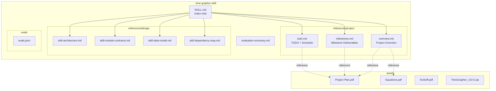
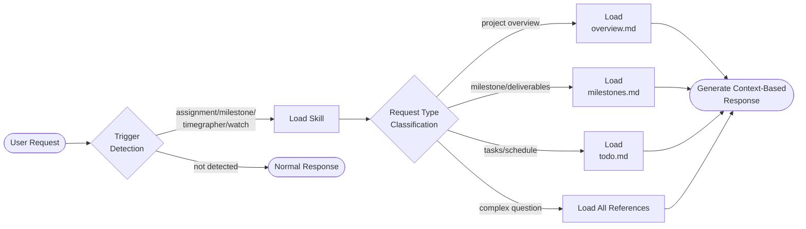

# TimeGrapher Skill — Architecture

## Skill Type

`artifact_type: skill` / `skill_scope: single-skill` / `target_agent: claude`

This skill is a **Context Provider** type that injects project context into Claude without external API calls or code execution to guide accurate responses.

## Module Relationship Diagram

## Processing Flow

## Design Principles

| Principle | Application |
|-----------|-------------|
| **SRP** | SKILL.md serves only as index; detailed content is separated into references/ |
| **OCP** | New milestones/deliverables only require modifying files under references/project/ |
| **DIP** | No direct dependency on assets/*.pdf; accessed through organized references/ |
