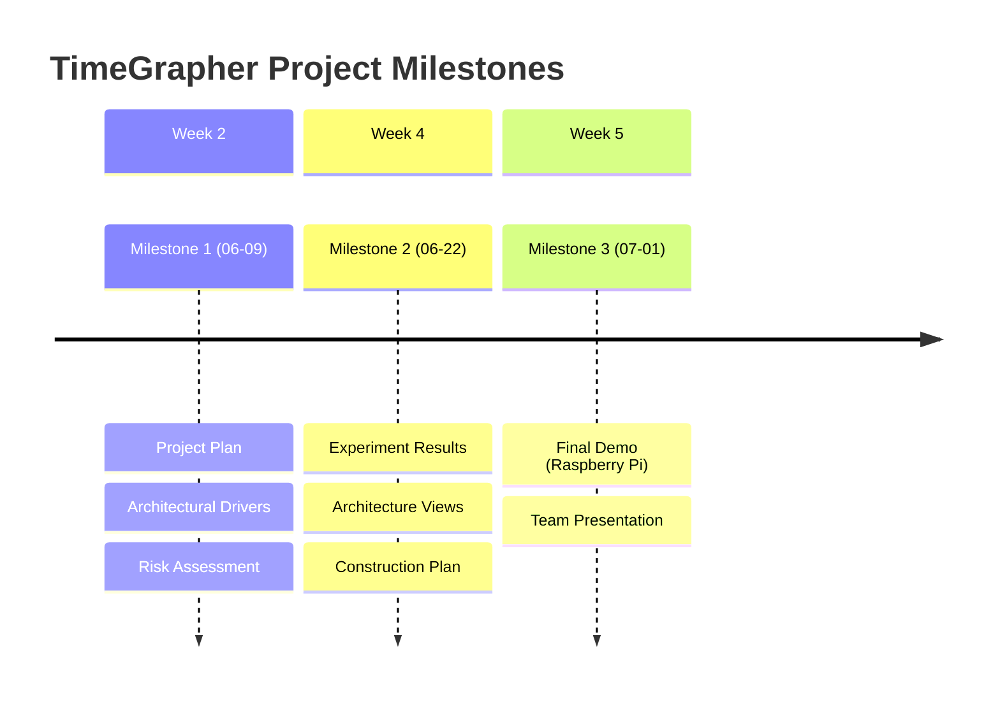

# TimeGrapher — Milestone Deliverables

Project duration: ~5 weeks (2026-05-27 ~ 2026-07-01)

## Milestone Overview

---

## Milestone 1 — `2026-06-09 (Tue)` Due

> Requirements, Project Plan, Architectural Drivers, Risk, Planned Experiments, Architectural Approaches

### Deliverables

| Deliverable | Description |
|-------------|-------------|
| **Project Plan** | Role assignments, tasks, milestone definitions / architecture-based implementation tasks / technical experiment plans |
| **Architectural Drivers** | QA requirements in actionable form / linked to project goals / functional requirements defined / prioritized |
| **Risk Assessment** | Technical and non-technical risks identified / H-M-L probability and impact assessment / risk mitigation actions defined |
| **Planned Experiments** | Experiment purpose and questions clarified / completion criteria defined |
| **Architectural Approaches** | Architecture overview / key patterns, tactics, and design strategies / architecture linked to drivers |

### Review Checkpoints (Mentor Questions)

**Project Plan**
- [ ] Are role assignments and tasks clearly defined?
- [ ] Are architecture-based implementation tasks reflected?
- [ ] Are technical experiment plans included?

**Architectural Drivers**
- [ ] Are QA requirements expressed "actionably"? (measurable and verifiable)
- [ ] Are the drivers linked to the overall project goals?
- [ ] Are the functional requirements sufficiently understood?
- [ ] Are the requirements prioritized?

**Risk Assessment**
- [ ] Are technical and non-technical risks distinguished?
- [ ] Are probability and impact assessed on an H-M-L scale?
- [ ] Are actions defined to resolve open issues/risks?

**Planned Experiments**
- [ ] Are experiments specific and following the template?
- [ ] Is it clear which question/issue each experiment resolves?
- [ ] Are completion criteria clearly defined?

**Architectural Approaches**
- [ ] Is there an architecture overview-level description?
- [ ] Are key architectural approaches (tactics, patterns, design strategies) defined?
- [ ] Are the drivers and architecture linked?
- [ ] Is the design sufficient as an implementation guide?

---

## Milestone 2 — `2026-06-22 (Mon)` Due

> Experimentation Results, Architecture Design, Construction Plan

### Deliverables

| Deliverable | Description |
|-------------|-------------|
| **Updated Project Plan** | Risk-based plan updates / realistic implementation plan |
| **Experiment Results** | Completed experiment results / open issue resolution status / remaining experiments list |
| **Architecture — Module View** | Code-level structure and dependencies (at least 1 required) |
| **Architecture — Runtime/C&C View** | Component-connector runtime perspective (at least 1 required) |
| **Architecture — Deployment View** | Hardware placement and communication channels (including Raspberry Pi) |
| **Construction Plan** | Detailed implementation tasks / remaining schedule |

### Review Checkpoints (Mentor Questions)

**Project Plan Update**
- [ ] Has the team actively assessed risks and reflected them in the plan?
- [ ] Is there a plan for remaining critical issues/risks?
- [ ] Is the implementation plan realistic?

**Experiments/Results**
- [ ] What experiments were conducted?
- [ ] Did the experiment results resolve open questions/issues?
- [ ] Are there still remaining experiments?
- [ ] Are the experiments relevant to the overall system goals?

**Architecture**
- [ ] Module View: Is code-level structure and dependencies expressed?
- [ ] C&C View: Are components and connectors expressed? (runtime perspective)
- [ ] Deployment View: Are high-level component placement and communication channels expressed?
- [ ] Did experiments lead to architecture refinement?
- [ ] Do you understand the chosen architectural approaches and trade-offs?
- [ ] Does the architecture align with system goals?
- [ ] Are there no unresolved critical concerns?
- [ ] Has an architecture evaluation been performed?

---

## Milestone 3 — `2026-07-01 (Wed)` Due

> Final Demo + Team Presentation (20 min)

### Team Presentation (20 min)

Presentation coverage:

| Item | Contents |
|------|----------|
| **QA Requirements** | Select high-priority QA requirements + their impact on architecture |
| **Architecture** | Architecture views + key approaches + design rationale |
| **Experiments & Evaluation** | Experiment results and architecture evaluation activities |
| **Lessons Learned** | What went well / what went wrong / what we'd do differently |

> 20 minutes is not enough to cover all items in depth. Select 1-2 key points from each item for focused presentation.

### Final Demo (on Raspberry Pi)

Quality attributes to demonstrate:

| Attribute | Required Evidence |
|-----------|------------------|
| **Low Latency** | Present capture→process→display latency figures (in ms) |
| **Real-Time Performance** | Confirm real-time operation on Raspberry Pi |
| **Consistency** | Measurement stability (consistent values under same watch, same conditions) |
| **Accuracy** | Signal detection accuracy (comparison against WeiShi 1000 reference) |
| **Extensibility** | Explain the impact of adding new graphs/analyses on existing code |

Demo requirements:
- TimeGrapher GUI running on Raspberry Pi
- Demonstrate additionally implemented graphs, displays, and controls
- Explain what each added feature shows the user
- Emphasize how new visualizations are integrated into the existing app (not a separate prototype)
- Explain how architectural and implementation choices support quality attributes
