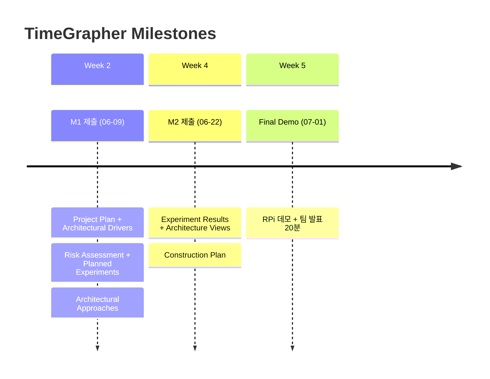

# 5/29 팀 미팅 Timetable (2시간)

> **날짜**: 2026-05-29  
> **목적**: Phase 0 마무리 + 전체 일정 합의 + Phase 1 킥오프 워크샵 준비

---

## Agenda Overview

| 시간 | 블록 | 내용 | 주관 |
|------|------|------|------|
| +0:00 ~ +0:20 | **[1] Phase 0 Review** | 완료 항목 확인 + AGC 미완 사항 처리 결정 | 전원 |
| +0:20 ~ +0:50 | **[2] 전체 일정 공유 및 합의** | Milestone 3개 + Week별 목표 + 핵심 결정 | 전원 |
| +0:50 ~ +1:40 | **[3] Phase 1 킥오프 워크샵 준비** | 6/1 발표 A/B/C/D 역할 분담 + 개인 준비 사항 | 전원 |
| +1:40 ~ +2:00 | **[4] 마무리 / 액션 아이템 확정** | 각자 to-do 정리 | 전원 |

---

## 블록별 상세

### [1] Phase 0 Review (20분)

**목표**: 완료 항목 공식 확인 + AGC 처리 방향 결정

| # | 항목 | 상태 |
|---|------|------|
| ✅ | 장비 수령 확인 (RPi 5 / 시계 2개 / 센서 스탠드 등) | 완료 |
| ✅ | PC에서 `TimeGrapher_v10.5` 빌드 및 실행 | 완료 |
| ✅ | RPi에서 빌드 확인 | 완료 |
| ✅ | 필수 문서 읽기 (Project Plan / Equations / Witschi pp.14-19) | 완료 |
| ⚠️ | **AGC (Auto Gain Control) 비활성화 확인** | 미완 |

**AGC 결정 사항** (10분):
- Phase 1 킥오프(6/1) 전에 누가 AlsaMixer로 AGC 비활성화 확인 후 팀에 공유?
- 6/1 `[발표 C]`에 AGC 확인 결과 포함

---

### [2] 전체 일정 공유 및 합의 (30분)

**목표**: 5주 일정 전원 인지 + 핵심 제약 조건 합의

#### 마일스톤 3개

#### 주간 목표

| Week | 기간 | 핵심 목표 |
|------|------|----------|
| **Week 1** | 06/01~06/05 | 킥오프 워크샵 + M1 문서 5종 초안 |
| **Week 2** | 06/08~06/12 | M1 제출(6/9) + 실험 3개 시작 |
| **Week 3** | 06/15~06/19 | 실험 결과 → 아키텍처 Views + 그래프 1~4 구현 |
| **Week 4** | 06/22~06/26 | M2 제출(6/22) + 그래프 5~11 + RPi 통합 |
| **Week 5** | 06/29~07/01 | 최종 검증 + 발표 준비 + Demo |

> **확정 사항** (오늘 미팅 전 합의 완료)
> - 공통 작업 시간대: 월~금 점심 이후 2시간
> - 협업 도구: 현재 프로젝트 (skill 기반)
> - 6/1 킥오프 워크샵 시간/장소: 확정

---

### [3] Phase 1 킥오프 워크샵 준비 (50분)

**목표**: 6/1 Kickoff Workshop 발표 A/B/C/D 역할 분담 + 각자 준비 사항 확정

#### 6/1 킥오프 워크샵 발표 구성

| 발표 | 내용 | 예상 시간 |
|------|------|----------|
| **[발표 A]** 코드베이스 워크스루 | Qt 모듈 구조 + 신호 처리 파이프라인 흐름도 | ~20분 |
| **[발표 B]** 도메인 문서 요약 | Witschi pp.14-19 요약 + Equations 핵심 정리 | ~20분 |
| **[발표 C]** RPi 빌드 & 배포 데모 | 빌드 절차 + AGC 비활성화 확인 결과 | ~20분 |
| **[발표 D]** QA + 채점 기준 공유 | Project Plan p.25-26 QA 정의 + p.32-33 발표/채점 기준 | ~20분 |

#### 역할 분담 (오늘 확정)

| 발표 | 사전 준비 내용 | 담당 |
|------|--------------|------|
| **[발표 A]** | 소스 분석 → 모듈 구조 다이어그램 + 파이프라인 흐름도 작성 | |
| **[발표 B]** | Witschi pp.14-19 + Equations PDF 핵심 정리본 작성 | |
| **[발표 C]** | RPi AlsaMixer AGC 비활성화 확인 + 빌드 절차 문서화 | |
| **[발표 D]** | Project Plan p.25-26, p.32-33 핵심 내용 정리 | |

> 준비 기간: 5/29(오늘) ~ 6/1(월) 킥오프 전

---

### [4] 마무리 및 액션 아이템 (20분)

#### 오늘 확정 체크리스트

- [ ] AGC 비활성화 담당자 지정
- [ ] 발표 A / B / C / D 담당자 확정
- [ ] M1 문서 역할 분담 방향 예고 (6/1 워크샵 후 확정)
