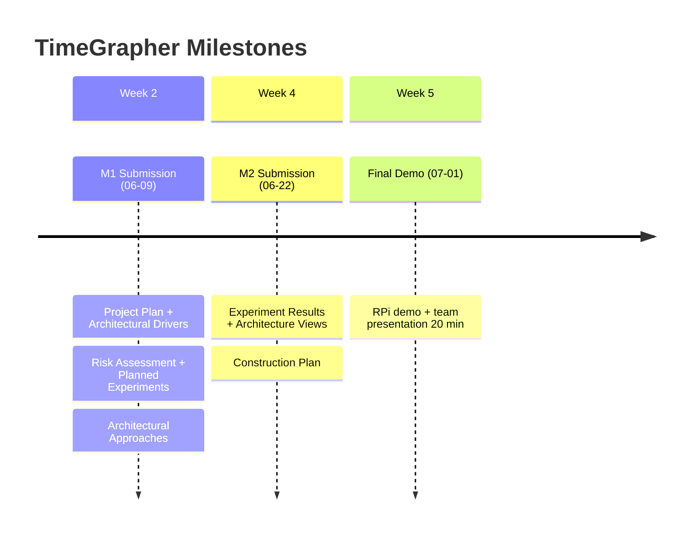

# 5/29 Team Meeting Timetable (2 hours)

> **Date**: 2026-05-29
> **Purpose**: Phase 0 wrap-up + full schedule alignment + Phase 1 kickoff workshop preparation

---

## Agenda Overview

| Time | Block | Content | Facilitator |
|------|-------|---------|-------------|
| +0:00 ~ +0:20 | **[1] Phase 0 Review** | Confirm completed items + decide on AGC pending item | All |
| +0:20 ~ +0:50 | **[2] Schedule Alignment** | 3 Milestones + weekly goals + key decisions | All |
| +0:50 ~ +1:40 | **[3] Kickoff Workshop Prep** | Assign Presentation A/B/C/D + individual prep items | All |
| +1:40 ~ +2:00 | **[4] Wrap-up / Action Items** | Finalize each person's to-dos | All |

---

## Block Details

### [1] Phase 0 Review (20 min)

**Goal**: Officially confirm completed items + decide how to handle AGC

| # | Item | Status |
|---|------|--------|
| ✅ | Equipment receipt confirmed (RPi 5 / 2 watches / sensor stand, etc.) | Done |
| ✅ | `TimeGrapher_v10.5` built and running on PC | Done |
| ✅ | Build confirmed on RPi | Done |
| ✅ | Required documents read (Project Plan / Equations / Witschi pp.14-19) | Done |
| ⚠️ | **AGC (Auto Gain Control) disable verification** | Pending |

**AGC decision items** (10 min):
- Who will verify AGC is disabled via AlsaMixer and share the result with the team before 6/1 kickoff?
- Include AGC verification result in `[Presentation C]` on 6/1

---

### [2] Schedule Alignment (30 min)

**Goal**: Ensure all members are aware of the 5-week schedule + agree on key constraints

#### 3 Milestones

#### Weekly Goals

| Week | Dates | Key Goal |
|------|-------|----------|
| **Week 1** | 06/01~06/05 | Kickoff workshop + 5 M1 document drafts |
| **Week 2** | 06/08~06/12 | M1 submission (6/9) + start 3 experiments |
| **Week 3** | 06/15~06/19 | Experiment results → Architecture Views + Graphs 1~4 implementation |
| **Week 4** | 06/22~06/26 | M2 submission (6/22) + Graphs 5~11 + RPi integration |
| **Week 5** | 06/29~07/01 | Final validation + presentation prep + Demo |

> **Already decided** (agreed before today's meeting)
> - Shared working hours: Mon~Fri, 2 hours after lunch
> - Collaboration tools: current project (skill-based)
> - 6/1 kickoff workshop time/location: confirmed

---

### [3] Kickoff Workshop Prep (50 min)

**Goal**: Assign Presentations A/B/C/D for 6/1 kickoff + confirm individual prep tasks

#### 6/1 Kickoff Workshop Presentation Structure

| Presentation | Content | Est. Time |
|-------------|---------|-----------|
| **[Presentation A]** Codebase Walkthrough | Qt module structure + signal processing pipeline diagram | ~20 min |
| **[Presentation B]** Domain Documents Summary | Witschi pp.14-19 summary + Equations key points | ~20 min |
| **[Presentation C]** RPi Build & Deployment Demo | Build procedure + AGC disable verification result | ~20 min |
| **[Presentation D]** QA + Grading Criteria Overview | Project Plan p.25-26 QA definitions + p.32-33 presentation/grading criteria | ~20 min |

#### Role Assignment (finalize today)

| Presentation | Preparation Required | Assignee |
|-------------|---------------------|----------|
| **[Presentation A]** | Source analysis → module structure diagram + pipeline flow diagram | |
| **[Presentation B]** | Witschi pp.14-19 + Equations PDF key summary document | |
| **[Presentation C]** | RPi AlsaMixer AGC disable verification + build procedure documentation | |
| **[Presentation D]** | Project Plan p.25-26, p.32-33 key content summary | |

> Prep period: 5/29 (today) ~ before 6/1 (Mon) kickoff

---

### [4] Wrap-up & Action Items (20 min)

#### Today's Finalization Checklist

- [ ] Assign AGC disable owner
- [ ] Finalize Presentation A / B / C / D assignees
- [ ] Preview M1 document role assignments (to be finalized after 6/1 workshop)
