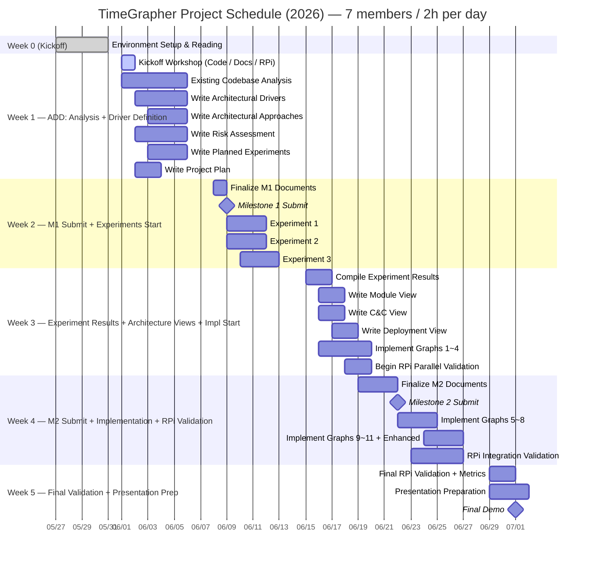

# TimeGrapher — TODO List

## Full Schedule



---

## Weekly Capacity & Focus

| Week | Dates | Capacity | Focus | ADD Phase |
|------|-------|----------|-------|-----------|
| Week 0 | 05/27~05/29 | — | Environment setup + reading | — |
| Week 1 | 06/01~06/05 | 70h | Codebase analysis + M1 document drafts | Driver Definition |
| Week 2 | 06/08~06/12 | 70h | M1 finalization & submission + experiments | Experimentation |
| Week 3 | 06/15~06/19 | 70h | Experiment results → Architecture Views + impl start | Design + Impl |
| Week 4 | 06/22~06/26 | 70h | M2 submission + implementation + RPi validation | Impl + Validate |
| Week 5 | 06/29~07/01 | 42h | Final validation + presentation prep | Demo Prep |

---

## Week 0 (05/27 ~ 05/29) — Environment Setup

> 목적: 개발 환경 준비 + 과제 내용 파악

- [x] Attend Kickoff Meeting (완료 05/27)
- [x] Confirm equipment receipt (완료 05/28)
  - [x] Raspberry Pi 5 (8GB RAM, 128GB microSD)
  - [x] 2 mechanical watches
  - [x] USB Sensor Stand + Converter Box
  - [x] WeiShi No.1000 Standalone Timegrapher
  - [x] 8" Touchscreen
- [x] Build and run `TimeGrapher_v10.5_Student.zip` on PC (완료 05/28)
  - [x] Qt Creator 설치 (Qt 6.11.1 macOS)
  - [x] 빌드 성공 확인 (cmake + AppleClang, Release build)
- [ ] Verify Raspberry Pi environment
  - [ ] RPi에서 `TimeGrapher_v10.5` 실행 확인
  - [ ] **AGC (Auto Gain Control) 비활성화 확인** (AlsaMixer)
    - 근거: Project Plan p.29 — *"student teams must verify that AGC is turned off. If AGC remains enabled, it can distort or suppress the microphone input and cause the TimeGrapher to perform unreliably."*
    - AGC는 환경 설정 항목 (설계 결정이 아님)
- [x] Read required documents (docs/week0/document-reading.md)
  - [x] Time Grapher Project Plan (Draft).pdf — 전체
  - [x] TimeGrapher Equations_v0.docx.pdf — 수식 이해 (Rate, Amplitude, Beat Error 계산)
  - [x] Witschi Training Course pp.14-19 — 그래프 해석 + Scope 이해

---

## Week 1 (06/01 ~ 06/05) — ADD Phase 1: Analysis + Driver Definition

> 목표: 코드베이스 이해 + M1 문서 5종 초안 완성
> Capacity: 70h / 예상: ~35h(초안) + ~20h(코드 분석) = ~55h

### 06/01 (Mon) — Kickoff Workshop (전원, ~3h)

> 역할 분담은 킥오프에서 팀 합의로 결정

- [ ] **[발표 A]** 코드베이스 워크스루 — Qt 모듈 구조 + 신호 처리 파이프라인
- [ ] **[발표 B]** 도메인 문서 — Witschi pp.14-19 요약 + Equations 핵심 정리
- [ ] **[발표 C]** RPi 빌드 & 배포 데모 — 빌드 절차 + AGC 비활성화 확인
- [ ] QA 5개 정량 목표 팀 합의 (Architectural Drivers 기반)
- [ ] M1 문서 역할 분담 확정

### Existing Codebase Analysis (As-Is 이해 — ADD 입력 자료)

> ⚠️ 이 단계의 결과물은 "현재 구조 이해"이며, Architecture Views의 기반이 아님
> Architecture Views는 Week 3에 ADD 설계 결정 이후 작성

- [ ] Qt 모듈 구조 파악 (파일별 역할)
- [ ] 신호 처리 파이프라인 흐름 이해 (capture → filter → event detection → display)
- [ ] Rate / Amplitude / Beat Error 계산 로직 검토
- [ ] Tabbed Graph Panel 확장 포인트 식별

### ADD Step 1 — Write Architectural Drivers (~8h)

> QA는 프로젝트 플랜 p.25-26 기준으로 정의

- [ ] 5개 QA를 측정 가능한 형태로 정의
  - **Real-Time Performance**: 96k sps 목표 / 48k sps 최소 / 192k sps stretch
  - **Low Latency**: capture→process / process→display / end-to-end 각 구간별 목표값 (ms)
  - **Correctness**: 계산값 내부 일관성 + 노이즈 환경에서의 안정성
  - **Measurement Accuracy**: T1/T3 이벤트 감지 정확도 (WeiShi 1000 대비 오차 범위)
  - **Extensibility**: 새 그래프 추가 시 변경되는 파일 수
- [ ] 기능 요구사항 목록 작성 및 우선순위 지정
- [ ] **06/02 (Tue) 오후: QA 초안 팀 전체 공유** — 모든 문서의 기준선

### ADD Step 2 — Write Architectural Approaches (~8h)

- [ ] 아키텍처 개요 작성 (코드베이스 분석 기반)
- [ ] QA와 연결된 핵심 패턴/전술/설계 전략 선정
  - 예: Plugin/Observer (Extensibility), Double-buffering (Latency), Pipeline (Real-Time)
- [ ] 각 Approach가 어떤 QA를 지원하는지 매핑

### Write Risk Assessment (~4h)

- [ ] 기술적 리스크 목록 (H/M/L 평가)
  - RPi 5에서 96k sps 실현 가능성
  - Qt 실시간 렌더링 성능 한계
  - T1/T3 이벤트 감지 정확도
- [ ] 비기술적 리스크 목록 (H/M/L 평가)
- [ ] 리스크별 대응 행동 정의

### Write Planned Experiments (~6h)

> 각 실험: 목적 / 해결할 질문 / 방법 / 완료 기준 명시

- [ ] **Experiment 1: RPi sps Performance** — 96k sps 달성 가능한가?
- [ ] **Experiment 2: Qt GUI Rendering FPS** — 실시간 렌더링이 병목인가?
- [ ] **Experiment 3: T1/T3 Detection Accuracy** — WeiShi 1000 대비 오차 범위

### Write Project Plan (~4h)

- [ ] 역할 분담 및 태스크 목록 정의
- [ ] 아키텍처 기반 구현 태스크 반영
- [ ] 기술 실험 계획 포함

### Weekly Timeline

| Date | All-Team | Individual Work |
|------|----------|-----------------|
| 06/01 (Mon) | Kickoff Workshop (~3h) | — |
| 06/02 (Tue) | **오후: QA 초안 공유 (30분)** | Drivers 초안 / 코드 심층 분석 / Risk 초안 |
| 06/03 (Wed) | — | Approaches 초안 / Experiments 초안 / Project Plan 초안 |
| 06/04 (Thu) | **오후: 중간 리뷰 미팅 (~1h)** | 개인 초안 완성 → 통합 시작 |
| 06/05 (Fri) | **오후: 주간 마무리 싱크 (~1h)** | 피드백 반영 + 문서 간 일관성 점검 |

---

## Week 2 (06/08 ~ 06/12) — M1 Finalization + Experiments Start

> 목표: M1 제출(06/09) + 3개 실험 시작
> Capacity: 70h / M1 마무리 ~10h + 실험 ~20h = ~30h

### M1 Finalization and Submission

- [ ] **M1 문서 최종화 (06/08 Mon)**
  - [ ] 문서 간 일관성 확인 (QA ↔ Risk ↔ Experiments ↔ Approaches)
  - [ ] 멘토 리뷰 질문 체크리스트 기준 자체 점검
- [ ] **Milestone 1 제출 (06/09 Tue)**
  - [ ] Project Plan
  - [ ] Architectural Drivers
  - [ ] Risk Assessment
  - [ ] Planned Experiments
  - [ ] Architectural Approaches
- [ ] ⚠️ 채점 루브릭 수령 확인 (프로젝트 플랜 p.33: "Week 2 or week 3에 배포 예정")

### Experiments Start (M1 제출 직후, 06/09~)

- [ ] **Experiment 1: RPi sps Performance** (~6h)
  - 96k / 48k / 192k sps 각각 처리 시간 측정
  - 완료 기준: sps별 처리 시간 수치 확보
- [ ] **Experiment 2: Qt GUI Rendering FPS** (~6h)
  - CPU 사용량 대비 그래프 업데이트 빈도 측정
  - 완료 기준: 렌더링 병목 여부 판단 + 허용 FPS 범위
- [ ] **Experiment 3: T1/T3 Detection Accuracy** (~8h)
  - 동일 시계로 Rate/Amplitude WeiShi 1000 대비 비교
  - 완료 기준: 오차 범위 수치

---

## Week 3 (06/15 ~ 06/19) — Experiment Results + Architecture Views + Impl Start

> 목표: 실험 결과 → 아키텍처 확정 → Views 작성 + 그래프 1~4 구현
> Capacity: 70h / 실험 결과 ~8h + Views ~16h + 구현 ~30h = ~54h

### Compile Experiment Results and Refine Architecture (~8h)

- [ ] 실험 1~3 결과 문서화 (결론 + 수치)
- [ ] 실험 결과에 따른 Architectural Approaches 수정 여부 검토
- [ ] 미해결 항목 / 추가 실험 필요 항목 목록화

### ADD Step 3 — Write Architecture Views (Approaches 확정 + 실험 결과 기반)

> ⚠️ 기존 코드베이스 전사가 아닌, ADD 설계 결정 이후 작성

- [ ] **Module View** (~6h) — 설계된 코드 레벨 구조 + 의존성
- [ ] **C&C View** (~6h) — 컴포넌트-커넥터 런타임 관점
- [ ] **Deployment View** (~4h) — RPi 기반 하드웨어 배치 + 통신 채널

### Mandatory Graphs Implementation — Graphs 1~4 (~30h)

> PC에서 동작 확인 후 RPi에서 즉시 병렬 검증

- [ ] **Trace Display** — Rate deviation + Amplitude 연속 기록 (~3h)
- [ ] **Rate & Amplitude Stability (Vario)** — Min/Max/Avg/σ 통계 (~4h)
- [ ] **Beat Error Display & Diagnostic Trace** (~4h)
- [ ] **Beat-Noise Scope (Scope 1 & 2)** — 개별 beat 파형 + Σ 평균 (~5h)

### RPi Parallel Validation

- [ ] 각 그래프 완성 후 즉시 RPi 빌드 및 동작 확인

---

## Week 4 (06/22 ~ 06/26) — M2 Finalization + Implementation + RPi Integration

> 목표: M2 제출(06/22) + 그래프 5~11 + Enhanced Features + RPi 통합 검증
> Capacity: 70h / M2 ~10h + 구현 ~40h + RPi 검증 ~15h = ~65h (필요 시 2h 초과 가능)

### M2 Finalization and Submission (~10h)

- [ ] **Milestone 2 제출 (06/22 Mon)**
  - [ ] Updated Project Plan (리스크 기반 업데이트, 현실적 구현 계획)
  - [ ] Experiment Results (완료 결과 + 미해결 항목)
  - [ ] Architecture — Module View
  - [ ] Architecture — C&C View
  - [ ] Architecture — Deployment View
  - [ ] Construction Plan (상세 구현 태스크 + 잔여 일정)

### Mandatory Graphs Implementation — Graphs 5~11 (~35h)

- [ ] **Watch-Position Testing (Test Positions)** — CH/CB/9H/6H/3H/12H 포지션 식별 및 표시 (~4h)
- [ ] **Multi-Position Sequence Display** — 최대 10개 포지션 비교 (~5h)
- [ ] **Long-Term Performance Graph** — 장기 Rate/Amplitude/Beat Error 트렌드 (~4h)
- [ ] **Escapement Analyzer & Marker-Line Display** — A/C 이벤트 마커 + ms 레이블 (~5h)
- [ ] **Time-Frequency Spectrogram** — 시간-주파수 에너지 분포 (~8h)
- [ ] **Waveform Comparison Display** — 정렬된 beat 파형 비교 + 타이밍 마커 (~6h)
- [ ] **Scope Mode (Synchronized Sweep)** — 오실로스코프 스타일 고정 스윕 윈도우 (~4h)
- [ ] **Scope Function (F0/F1/F2/F3 Filter Views)** — 4개 필터 뷰 동시 표시 (~8h)

### Enhanced Features Implementation (~18h)

- [ ] 모든 그래프 연속 실행 (stop/restart 불필요) (~3h)
- [ ] Interactive Start / Stop / **Pause** 컨트롤 (~3h)
- [ ] Pause 상태에서 시간 축 전후 탐색 (~4h)
- [ ] Interactive 타이밍 포인트 선택 (~3h)
- [ ] Sound Print 개선 (평균 윈도우 표시, 노이즈 감소) (~3h)
- [ ] Rate/Scope 그래프에 Raw signal waveform 오버레이 (~2h)

### Optional — AI Feature (~10h, 시간 여유 시)

> Project Plan p.12: 온디바이스 지능으로 신호 품질/이벤트 감지 개선

- [ ] Signal Quality Classification (good / noisy / clipped / too weak)
- [ ] Bad Data Rejection (측정에 사용하지 않을 신호 구간 감지)
- [ ] User Guidance ("signal too noisy", "reposition watch" 등 실시간 힌트)

### RPi Integration Validation (~15h)

- [ ] 모든 기능 RPi 빌드 및 실행
- [ ] 레이턴시 측정: capture→process / process→display / end-to-end (평균 + worst-case)
- [ ] Dropped audio block + missed beat 횟수 확인
- [ ] 96k sps 동작 확인

---

## Week 5 (06/29 ~ 07/01) — Final Validation + Presentation Prep

> 목표: 최종 RPi 검증 + 발표 준비 + Final Demo
> Capacity: 42h (3일) — 구현은 Week 4 말까지 완료 필수

### Final RPi Validation (~10h)

- [ ] RPi 전체 기능 최종 검증
- [ ] 레이턴시 수치 최종화 및 문서화
- [ ] QA 증거 수집
  - Low Latency: 구간별 레이턴시 수치 (ms)
  - Real-Time Performance: RPi 실시간 동작 확인
  - Correctness: 동일 시계, 동일 조건에서 측정 안정성
  - Accuracy: WeiShi 1000 대비 값 비교
  - Extensibility: 새 그래프 추가 시 변경 파일 수

### Presentation Preparation (~20h, 전원)

> 발표 시간: 20분 — 각 항목에서 핵심 1~2개만 선별

- [ ] 발표 구성 (프로젝트 플랜 p.32 기준)
  - [ ] QA Requirements — 아키텍처에 가장 영향을 준 고우선 QA
  - [ ] Architecture Views + 핵심 Approaches + 설계 근거
  - [ ] 실험 결과 + 아키텍처 평가
  - [ ] Lessons Learned (잘된 것 / 잘못된 것 / 다시 한다면)
- [ ] 전체 팀 리허설

### Milestone 3 — Final Demo (07/01 Wed)

- [ ] RPi에서 TimeGrapher GUI 실행 데모
- [ ] 추가 구현 그래프, 디스플레이, 컨트롤 시연
- [ ] 각 추가 기능이 사용자에게 무엇을 보여주는지 설명
- [ ] Low Latency / Real-Time Performance 증거 제시 (수치)
- [ ] Extensibility 설명 (새 그래프 추가 시 기존 코드 영향 범위)

---

## Notes

### 채점 루브릭
- TimeGrapher 전용 루브릭은 **Week 2 또는 Week 3에 배포 예정** (프로젝트 플랜 p.33)
- assets에 있는 "LG SW Architect Final Demo Grading Score Sheet"는 **다른 과제(ADS-B)용**이므로 참고하지 말 것

### ADD 프로세스 흐름
```
Week 0: 환경 설정
  ↓
Week 1: ADD Step 1 (Architectural Drivers) + Step 2 (Approaches) 초안
  ↓
Week 2: M1 제출 + 실험 시작
  ↓
Week 3: 실험 결과 → ADD Step 3 (Architecture Views) + 구현 시작
  ↓
Week 4: M2 제출 + 구현 완성 + RPi 통합
  ↓
Week 5: 검증 + 발표 준비 + Demo
```

---

## Contacts

| Role | Name | Email |
|------|------|-------|
| Lead Engineer | Jason Popowski | jpopowsk@andrew.cmu.edu |
| Lead Engineer | Steve Beck | srbeck@andrew.cmu.edu |
| CC | Dan Plakosh | dplakosh@sei.cmu.edu |
