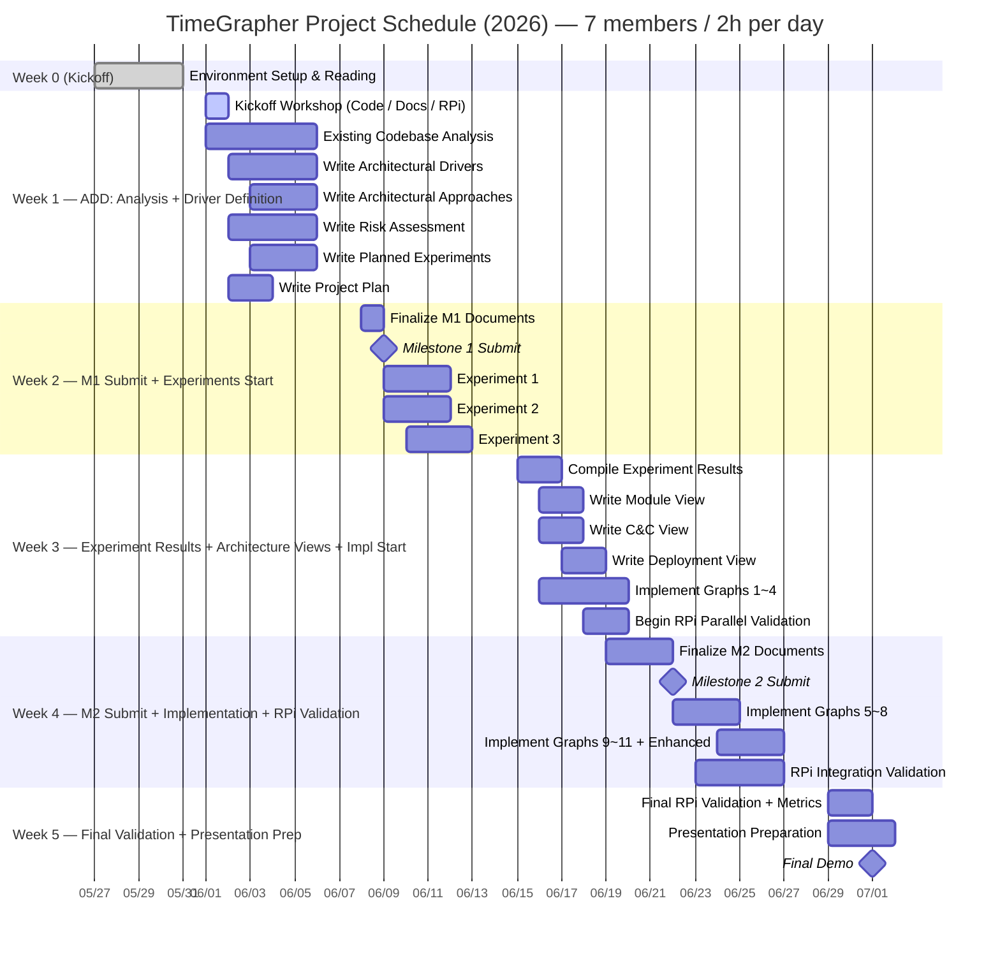

# TimeGrapher — TODO List

## Full Schedule



---

## Weekly Capacity & Focus

| Week | Dates | Capacity | Focus | ADD Phase |
|------|-------|----------|-------|-----------|
| Week 0 | 05/27~05/29 | — | Environment setup + reading | — |
| Week 1 | 06/01~06/05 | 70h | Codebase analysis + M1 document drafts | Driver Definition |
| Week 2 | 06/08~06/12 | 70h | M1 finalization & submission + experiments | Experimentation |
| Week 3 | 06/15~06/19 | 70h | Experiment results → Architecture Views + impl start | Design + Impl |
| Week 4 | 06/22~06/26 | 70h | M2 submission + implementation + RPi validation | Impl + Validate |
| Week 5 | 06/29~07/01 | 42h | Final validation + presentation prep | Demo Prep |

---

## Week 0 (05/27 ~ 05/29) — Environment Setup

> Goal: Prepare development environment + understand project requirements

- [x] Attend Kickoff Meeting (completed 05/27)
- [x] Confirm equipment receipt (completed 05/28)
  - [x] Raspberry Pi 5 (8GB RAM, 128GB microSD)
  - [x] 2 mechanical watches
  - [x] USB Sensor Stand + Converter Box
  - [x] WeiShi No.1000 Standalone Timegrapher
  - [x] 8" Touchscreen
- [x] Build and run `TimeGrapher_v10.5_Student.zip` on PC (completed 05/28)
  - [x] Install Qt Creator (Qt 6.11.1 macOS)
  - [x] Confirm successful build (cmake + AppleClang, Release build)
- [ ] Verify Raspberry Pi environment
  - [x] Confirm `TimeGrapher_v10.5` runs on RPi (completed 05/29)
  - [ ] **Verify AGC (Auto Gain Control) is disabled** (AlsaMixer)
    - Rationale: Project Plan p.29 — *"student teams must verify that AGC is turned off. If AGC remains enabled, it can distort or suppress the microphone input and cause the TimeGrapher to perform unreliably."*
    - AGC is an environment configuration item (not an architecture decision)
- [x] Read required documents (docs/week0/document-reading.md)
  - [x] Time Grapher Project Plan (Draft).pdf — full document
  - [x] TimeGrapher Equations_v0.docx.pdf — understand equations (Rate, Amplitude, Beat Error calculations)
  - [x] Witschi Training Course pp.14-19 — graph interpretation + Scope understanding

---

## Week 1 (06/01 ~ 06/05) — ADD Phase 1: Analysis + Driver Definition

> Goal: Understand codebase + complete drafts of 5 M1 documents
> Capacity: 70h / Estimated: ~35h (drafts) + ~20h (code analysis) = ~55h

### 06/01 (Mon) — Kickoff Workshop (all members, ~3h)

> Role assignments to be finalized by team consensus at kickoff

- [ ] **[Presentation A]** Codebase walkthrough — Qt module structure + signal processing pipeline
- [ ] **[Presentation B]** Domain documents — Witschi pp.14-19 summary + Equations key points
- [ ] **[Presentation C]** RPi build & deployment demo — build procedure + AGC disable verification
- [ ] **[Presentation D]** QA + grading criteria overview — Project Plan p.25-26 QA definitions + p.32-33 presentation/grading criteria
- [ ] Team consensus on 5 QA quantitative targets (based on Presentation D)
- [ ] Finalize M1 document role assignments

### Existing Codebase Analysis (Understanding As-Is — ADD input material)

> ⚠️ The output of this step is "understanding the current structure," not the basis for Architecture Views.
> Architecture Views are written in Week 3, after ADD design decisions are made.

- [ ] Understand Qt module structure (role of each file)
- [ ] Understand signal processing pipeline flow (capture → filter → event detection → display)
- [ ] Review Rate / Amplitude / Beat Error calculation logic
- [ ] Identify extension points in the Tabbed Graph Panel

### ADD Step 1 — Write Architectural Drivers (~8h)

> QA defined based on Project Plan p.25-26

- [ ] Define 5 QAs in measurable form
  - **Real-Time Performance**: 96k sps target / 48k sps minimum / 192k sps stretch
  - **Low Latency**: target values (ms) for each segment — capture→process / process→display / end-to-end
  - **Correctness**: internal consistency of computed values + stability under noisy conditions
  - **Measurement Accuracy**: T1/T3 event detection accuracy (error margin vs. WeiShi 1000)
  - **Extensibility**: number of files changed when adding a new graph
- [ ] List functional requirements and prioritize
- [ ] **06/02 (Tue) afternoon: Share QA draft with full team** — baseline for all documents

### ADD Step 2 — Write Architectural Approaches (~8h)

- [ ] Write architecture overview (based on codebase analysis)
- [ ] Select key patterns/tactics/design strategies linked to QAs
  - e.g., Plugin/Observer (Extensibility), Double-buffering (Latency), Pipeline (Real-Time)
- [ ] Map each Approach to the QAs it supports

### Write Risk Assessment (~4h)

- [ ] List technical risks (H/M/L assessment)
  - Feasibility of achieving 96k sps on RPi 5
  - Qt real-time rendering performance limits
  - T1/T3 event detection accuracy
- [ ] List non-technical risks (H/M/L assessment)
- [ ] Define mitigation actions per risk

### Write Planned Experiments (~6h)

> Each experiment: state purpose / question to resolve / method / completion criteria

- [ ] **Experiment 1: RPi sps Performance** — Is 96k sps achievable?
- [ ] **Experiment 2: Qt GUI Rendering FPS** — Is real-time rendering a bottleneck?
- [ ] **Experiment 3: T1/T3 Detection Accuracy** — Error margin vs. WeiShi 1000

### Write Project Plan (~4h)

- [ ] Define role assignments and task list
- [ ] Reflect architecture-based implementation tasks
- [ ] Include technical experiment plans

### Weekly Timeline

| Date | All-Team | Individual Work |
|------|----------|-----------------|
| 06/01 (Mon) | Kickoff Workshop (~3h) | — |
| 06/02 (Tue) | **Afternoon: Share QA draft (30 min)** | Drivers draft / deep code analysis / Risk draft |
| 06/03 (Wed) | — | Approaches draft / Experiments draft / Project Plan draft |
| 06/04 (Thu) | **Afternoon: Mid-week review meeting (~1h)** | Complete individual drafts → begin integration |
| 06/05 (Fri) | **Afternoon: Weekly wrap-up sync (~1h)** | Incorporate feedback + cross-document consistency check |

---

## Week 2 (06/08 ~ 06/12) — M1 Finalization + Experiments Start

> Goal: M1 submission (06/09) + start 3 experiments
> Capacity: 70h / M1 finalization ~10h + experiments ~20h = ~30h

### M1 Finalization and Submission

- [ ] **Finalize M1 documents (06/08 Mon)**
  - [ ] Cross-document consistency check (QA ↔ Risk ↔ Experiments ↔ Approaches)
  - [ ] Self-review against mentor review question checklist
- [ ] **Milestone 1 submission (06/09 Tue)**
  - [ ] Project Plan
  - [ ] Architectural Drivers
  - [ ] Risk Assessment
  - [ ] Planned Experiments
  - [ ] Architectural Approaches
- [ ] ⚠️ Confirm grading rubric receipt (Project Plan p.33: "to be distributed in Week 2 or Week 3")

### Experiments Start (immediately after M1 submission, 06/09~)

- [ ] **Experiment 1: RPi sps Performance** (~6h)
  - Measure processing time at 96k / 48k / 192k sps
  - Completion criteria: processing time figures per sps obtained
- [ ] **Experiment 2: Qt GUI Rendering FPS** (~6h)
  - Measure graph update frequency vs. CPU usage
  - Completion criteria: rendering bottleneck determination + acceptable FPS range
- [ ] **Experiment 3: T1/T3 Detection Accuracy** (~8h)
  - Compare Rate/Amplitude against WeiShi 1000 on the same watch
  - Completion criteria: error margin figures

---

## Week 3 (06/15 ~ 06/19) — Experiment Results + Architecture Views + Impl Start

> Goal: Experiment results → finalize architecture → write Views + implement Graphs 1~4
> Capacity: 70h / Experiment results ~8h + Views ~16h + implementation ~30h = ~54h

### Compile Experiment Results and Refine Architecture (~8h)

- [ ] Document results of Experiments 1~3 (conclusions + figures)
- [ ] Review whether Architectural Approaches need revision based on experiment results
- [ ] List unresolved items / items requiring additional experiments

### ADD Step 3 — Write Architecture Views (based on finalized Approaches + experiment results)

> ⚠️ Write based on ADD design decisions, not a transcription of the existing codebase

- [ ] **Module View** (~6h) — designed code-level structure + dependencies
- [ ] **C&C View** (~6h) — component-connector runtime perspective
- [ ] **Deployment View** (~4h) — RPi-based hardware placement + communication channels

### Mandatory Graphs Implementation — Graphs 1~4 (~30h)

> Verify on PC, then immediately validate in parallel on RPi

- [ ] **Trace Display** — continuous recording of Rate deviation + Amplitude (~3h)
- [ ] **Rate & Amplitude Stability (Vario)** — Min/Max/Avg/σ statistics (~4h)
- [ ] **Beat Error Display & Diagnostic Trace** (~4h)
- [ ] **Beat-Noise Scope (Scope 1 & 2)** — individual beat waveform + Σ average (~5h)

### RPi Parallel Validation

- [ ] Immediately build and verify on RPi after each graph is completed

---

## Week 4 (06/22 ~ 06/26) — M2 Finalization + Implementation + RPi Integration

> Goal: M2 submission (06/22) + Graphs 5~11 + Enhanced Features + RPi integration validation
> Capacity: 70h / M2 ~10h + implementation ~40h + RPi validation ~15h = ~65h (up to 2h overtime if needed)

### M2 Finalization and Submission (~10h)

- [ ] **Milestone 2 submission (06/22 Mon)**
  - [ ] Updated Project Plan (risk-based updates, realistic implementation plan)
  - [ ] Experiment Results (completed results + unresolved items)
  - [ ] Architecture — Module View
  - [ ] Architecture — C&C View
  - [ ] Architecture — Deployment View
  - [ ] Construction Plan (detailed implementation tasks + remaining schedule)

### Mandatory Graphs Implementation — Graphs 5~11 (~35h)

- [ ] **Watch-Position Testing (Test Positions)** — identify and display CH/CB/9H/6H/3H/12H positions (~4h)
- [ ] **Multi-Position Sequence Display** — compare up to 10 positions (~5h)
- [ ] **Long-Term Performance Graph** — long-term Rate/Amplitude/Beat Error trends (~4h)
- [ ] **Escapement Analyzer & Marker-Line Display** — A/C event markers + ms labels (~5h)
- [ ] **Time-Frequency Spectrogram** — time-frequency energy distribution (~8h)
- [ ] **Waveform Comparison Display** — aligned beat waveform comparison + timing markers (~6h)
- [ ] **Scope Mode (Synchronized Sweep)** — oscilloscope-style fixed sweep window (~4h)
- [ ] **Scope Function (F0/F1/F2/F3 Filter Views)** — simultaneous display of 4 filter views (~8h)

### Enhanced Features Implementation (~18h)

- [ ] Continuous operation for all graphs (no stop/restart required) (~3h)
- [ ] Interactive Start / Stop / **Pause** controls (~3h)
- [ ] Time-axis navigation (forward/backward) while paused (~4h)
- [ ] Interactive timing point selection (~3h)
- [ ] Sound Print improvement (average window display, noise reduction) (~3h)
- [ ] Raw signal waveform overlay on Rate/Scope graphs (~2h)

### Optional — AI Feature (~10h, if time permits)

> Project Plan p.12: on-device intelligence to improve signal quality / event detection

- [ ] Signal Quality Classification (good / noisy / clipped / too weak)
- [ ] Bad Data Rejection (detect signal segments not suitable for measurement)
- [ ] User Guidance (real-time hints such as "signal too noisy", "reposition watch")

### RPi Integration Validation (~15h)

- [ ] Build and run all features on RPi
- [ ] Measure latency: capture→process / process→display / end-to-end (average + worst-case)
- [ ] Check dropped audio block + missed beat counts
- [ ] Confirm 96k sps operation

---

## Week 5 (06/29 ~ 07/01) — Final Validation + Presentation Prep

> Goal: Final RPi validation + presentation preparation + Final Demo
> Capacity: 42h (3 days) — implementation must be complete by end of Week 4

### Final RPi Validation (~10h)

- [ ] Final validation of all features on RPi
- [ ] Finalize and document latency figures
- [ ] Collect QA evidence
  - Low Latency: per-segment latency figures (ms)
  - Real-Time Performance: confirm real-time operation on RPi
  - Correctness: measurement stability under same watch, same conditions
  - Accuracy: value comparison against WeiShi 1000
  - Extensibility: number of files changed when adding a new graph

### Presentation Preparation (~20h, all members)

> Presentation time: 20 min — select only 1~2 key points from each section

- [ ] Presentation structure (based on Project Plan p.32)
  - [ ] QA Requirements — high-priority QAs with the greatest impact on architecture
  - [ ] Architecture Views + key Approaches + design rationale
  - [ ] Experiment results + architecture evaluation
  - [ ] Lessons Learned (what went well / what went wrong / what we'd do differently)
- [ ] Full team rehearsal

### Milestone 3 — Final Demo (07/01 Wed)

- [ ] Run TimeGrapher GUI on RPi demo
- [ ] Demonstrate additionally implemented graphs, displays, and controls
- [ ] Explain what each added feature shows the user
- [ ] Present Low Latency / Real-Time Performance evidence (figures)
- [ ] Explain Extensibility (scope of impact on existing code when adding a new graph)

---

## Notes

### Grading Rubric
- TimeGrapher-specific rubric is **scheduled for distribution in Week 2 or Week 3** (Project Plan p.33)
- The "LG SW Architect Final Demo Grading Score Sheet" in assets is **for a different assignment (ADS-B)** — do not use as reference

### ADD Process Flow
```
Week 0: Environment setup
  ↓
Week 1: ADD Step 1 (Architectural Drivers) + Step 2 (Approaches) drafts
  ↓
Week 2: M1 submission + experiments start
  ↓
Week 3: Experiment results → ADD Step 3 (Architecture Views) + implementation start
  ↓
Week 4: M2 submission + implementation complete + RPi integration
  ↓
Week 5: Validation + presentation prep + Demo
```

---

## Contacts

| Role | Name | Email |
|------|------|-------|
| Lead Engineer | Jason Popowski | jpopowsk@andrew.cmu.edu |
| Lead Engineer | Steve Beck | srbeck@andrew.cmu.edu |
| CC | Dan Plakosh | dplakosh@sei.cmu.edu |
