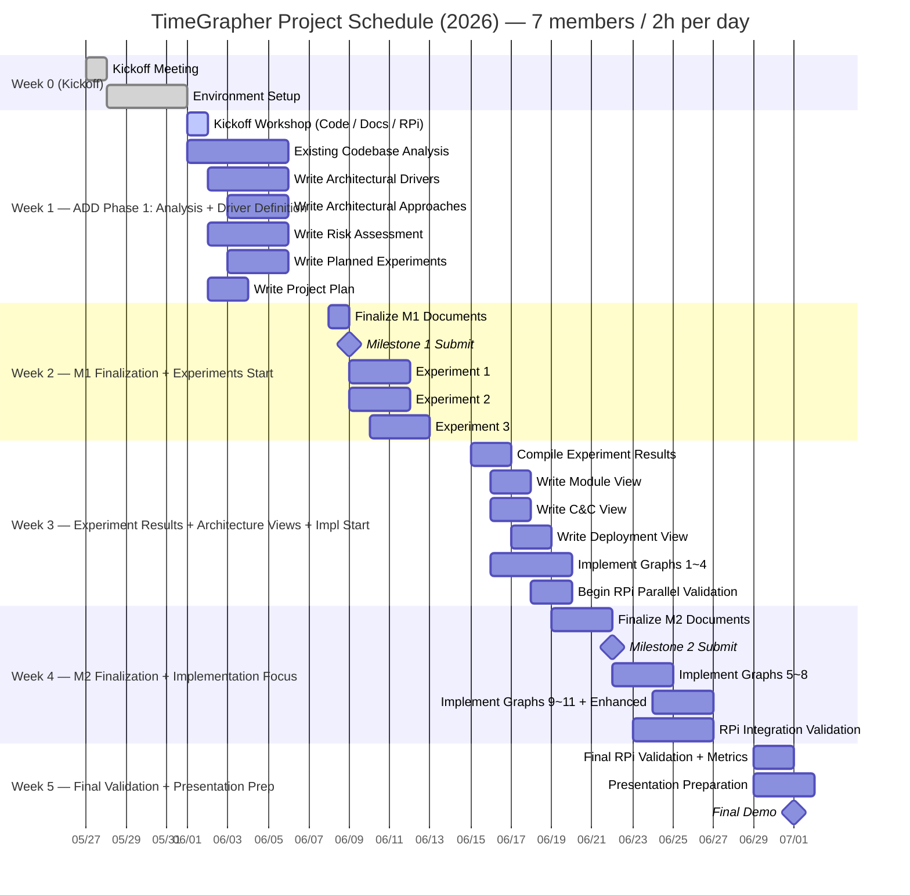

# TimeGrapher — TODO List

## Full Schedule

---

## Weekly Capacity & Focus

| Week | Capacity | Focus | ADD Phase |
|------|----------|-------|-----------|
| Week 1 | 70h | Codebase analysis + M1 document drafts | Driver Definition |
| Week 2 | 70h | M1 finalization & submission + experiments start | Experiment |
| Week 3 | 70h | Experiment results → Architecture Views + impl start | Design + Impl |
| Week 4 | 70h | M2 submission + implementation focus + RPi validation | Impl + Validate |
| Week 5 | 42h | Final validation + presentation preparation | Demo Prep |

---

## Week 0 (05/25 ~ 05/29) — Kickoff

- [x] Attend Kickoff Meeting (completed 05/27)
- [x] Confirm equipment receipt (completed 05/28)
  - [x] Raspberry Pi 5 (8GB RAM, 128GB microSD)
  - [x] 2 mechanical watches
  - [x] USB Sensor Stand + Converter Box
  - [x] WeiShi No.1000 Standalone Timegrapher
  - [x] 8" Touchscreen
- [ ] Verify Raspberry Pi environment
  - [ ] Confirm `TimeGrapher_v10.5` runs
  - [ ] **Disable AGC (Auto Gain Control)** (verify in AlsaMixer)
- [x] Build and run `TimeGrapher_v10.5_Student.zip` on PC (completed 05/28)
  - [x] Install Qt Creator (Qt 6.11.1 macOS, ~/Qt)
  - [x] Confirm build success (cmake + AppleClang, Release build, warnings only)
- [ ] Read required documents
  - [ ] Time Grapher Project Plan (Draft).pdf — full document
  - [ ] TimeGrapher Equations_v0.docx.pdf — understand formulas
  - [ ] Witschi Training Course pp.14-19 — graph interpretation and Scope

---

## Week 1 (06/01 ~ 06/05) — ADD Phase 1: Analysis + Driver Definition

> Goal: Understand current codebase + complete drafts of all 5 M1 documents  
> Capacity: 70h / Estimated: ~35h (drafts) + ~20h (codebase analysis) = ~55h

### 06/01 (Mon) — Kickoff Workshop (All members, ~3h)

- [ ] **[Presentation A]** Codebase walkthrough — Qt module structure + signal processing pipeline
- [ ] **[Presentation B]** Domain documents — Witschi pp.14-19 highlights + Equations summary
- [ ] **[Presentation C]** RPi build & deploy demo — build steps + AGC disable verification
- [ ] Team consensus on QA 5 quantitative targets (foundation for Architectural Drivers)
- [ ] Finalize M1 document role assignments

### Existing Codebase Analysis (As-Is Understanding — Input to ADD)

> ⚠️ Output of this phase is "understanding of current structure" only — NOT the basis for Architecture Views  
> Architecture Views are written in Week 3, after ADD design decisions are made

- [ ] Understand Qt module structure (which files serve which roles)
- [ ] Understand signal processing pipeline flow (capture → filter → event detection → display)
- [ ] Review existing Rate / Amplitude / Beat Error calculation logic
- [ ] Identify extension points in Tabbed Graph Panel

### ADD Step 1 — Write Architectural Drivers (~8h, Member 3)

- [ ] Express 5 QAs in measurable form
  - Real-Time Performance: define target sps values (96k target / 48k min / 192k stretch)
  - Low Latency: define per-segment latency targets (capture→process / process→display / end-to-end)
  - Correctness: define acceptable deviation vs. WeiShi 1000
  - Measurement Accuracy: define acceptable T1/T3 detection error range
  - Extensibility: limit number of files changed when adding a new graph
- [ ] Write and prioritize functional requirements list
- [ ] **Share QA draft with full team on 06/02 (Tue) afternoon** — baseline for all other documents

### ADD Step 2 — Write Architectural Approaches (~8h, Member 4)

- [ ] Write architecture overview (informed by codebase analysis)
- [ ] Select key patterns / tactics / design strategies linked to Drivers
  - e.g. Plugin/Observer pattern (Extensibility), Double-buffering (Latency), Pipeline structure (Real-Time)
- [ ] Map each Approach to the QA it addresses

### Write Risk Assessment (~4h, Member 2)

- [ ] Write technical risk list (H/M/L assessment)
  - Feasibility of 96k sps on RPi 5
  - Qt real-time rendering performance limits
  - T1/T3 event detection accuracy
  - Signal distortion if AGC not disabled
- [ ] Write non-technical risk list (H/M/L assessment)
- [ ] Define mitigation actions per risk

### Write Planned Experiments (~6h, Members 5·6)

- [ ] Specify per experiment: purpose / question to resolve / method / completion criteria
  - Experiment 1: RPi sps performance (is 96k sps achievable?)
  - Experiment 2: Qt GUI rendering FPS (is real-time rendering a bottleneck?)
  - Experiment 3: T1/T3 detection accuracy (measure error vs. WeiShi 1000)

### Write Project Plan (~4h, Member 1)

- [ ] Define role assignments and task list
- [ ] Reflect architecture-based implementation tasks
- [ ] Include technical experiment plans

### Weekly Timeline

| Date | All-Team | Individual Work |
|------|----------|-----------------|
| 06/01 (Mon) | Kickoff Workshop (~3h) | — |
| 06/02 (Tue) | **Afternoon: Share QA draft (30 min)** | Drivers draft / deep codebase analysis / Risk draft |
| 06/03 (Wed) | — | Approaches draft / Experiments draft / Project Plan draft |
| 06/04 (Thu) | **Afternoon: Mid-week review meeting (~1h)** | Complete individual drafts → start consolidation |
| 06/05 (Fri) | **Afternoon: Weekly wrap-up sync (~1h)** | Apply feedback + cross-document consistency check |

---

## Week 2 (06/08 ~ 06/12) — M1 Finalization + Experiments Start

> Goal: Submit M1 (06/09) + kick off 3 experiments  
> Capacity: 70h / M1 wrap-up ~10h + experiments ~20h = ~30h

### M1 Finalization and Submission

- [ ] **Finalize all M1 documents (06/08 Mon)**
  - [ ] Verify cross-document consistency (QA ↔ Risk ↔ Experiments ↔ Approaches)
  - [ ] Self-check against mentor review question checklist
- [ ] **Submit Milestone 1 (06/09 Tue)**
  - [ ] Project Plan
  - [ ] Architectural Drivers
  - [ ] Risk Assessment
  - [ ] Planned Experiments
  - [ ] Architectural Approaches

### Experiments Start (immediately after M1 submission on 06/09)

- [ ] **Experiment 1: RPi sps Performance** (~6h, Member 5)
  - Run and measure processing time at 96k / 48k / 192k sps
  - Completion criteria: processing time figures per sps level
- [ ] **Experiment 2: Qt GUI Rendering FPS** (~6h, Member 6)
  - Measure graph update frequency vs. CPU usage
  - Completion criteria: rendering bottleneck determination + acceptable FPS range
- [ ] **Experiment 3: T1/T3 Detection Accuracy** (~8h, Members 2·4)
  - Compare Rate/Amplitude readings vs. WeiShi 1000 using same watch
  - Completion criteria: error range figures

---

## Week 3 (06/15 ~ 06/19) — Experiment Results + Architecture Views + Impl Start

> Goal: Experiment results → refine architecture → write Views + implement graphs 1~4  
> Capacity: 70h / Experiment results ~8h + Views ~16h + impl ~30h = ~54h

### Compile Experiment Results and Refine Architecture (~8h)

- [ ] Document results of experiments 1~3 (conclusions + figures)
- [ ] Review whether Architectural Approaches need revision based on results
- [ ] List unresolved questions / items needing additional experiments

### ADD Step 3 — Write Architecture Views (based on Approaches + experiment results)

> ⚠️ Written after Approaches are confirmed — not a transcription of the existing codebase

- [ ] **Module View** (~6h, Members 4·7) — designed code-level structure + dependencies
- [ ] **C&C View** (~6h, Members 3·7) — component-connector runtime perspective
- [ ] **Deployment View** (~4h, Member 1) — RPi-based hardware placement + communication channels

### Mandatory Graphs Implementation — Graphs 1~4 (~30h, Members 2·4·5·6)

> Verify RPi build in parallel — confirm on RPi immediately after each graph works on PC

- [ ] **Trace Display** — continuous Rate deviation + Amplitude recording (~3h)
- [ ] **Rate & Amplitude Stability (Vario)** — Min/Max/Avg/σ statistics (~4h)
- [ ] **Beat Error Display & Diagnostic Trace** (~4h)
- [ ] **Beat-Noise Scope (Scope 1 & 2)** — individual beat waveform + Σ averaging (~5h)

### RPi Parallel Validation

- [ ] Build and run each completed graph on RPi immediately after PC verification

---

## Week 4 (06/22 ~ 06/26) — M2 Finalization + Implementation Focus + RPi Integration

> Goal: Submit M2 (06/22) + implement graphs 5~11 + Enhanced Features + RPi integration validation  
> Capacity: 70h / M2 ~10h + impl ~40h + RPi validation ~15h = ~65h (can extend beyond 2h/day if needed)

### M2 Finalization and Submission (~10h)

- [ ] **Submit Milestone 2 (06/22 Mon)**
  - [ ] Updated Project Plan (risk-adjusted, realistic implementation plan)
  - [ ] Experiment Results (completed results + open items)
  - [ ] Architecture — Module View
  - [ ] Architecture — C&C View
  - [ ] Architecture — Deployment View
  - [ ] Construction Plan (detailed implementation tasks + remaining schedule)

### Mandatory Graphs Implementation — Graphs 5~11 (~35h)

- [ ] **Multi-Position Sequence Display** — compare up to 10 positions (~5h)
- [ ] **Long-Term Performance Graph** — long-term Rate/Amplitude/Beat Error trends (~4h)
- [ ] **Escapement Analyzer & Marker-Line Display** — A/C event markers + ms labels (~5h)
- [ ] **Time-Frequency Spectrogram** — time-frequency energy distribution (~8h)
- [ ] **Waveform Comparison Display** — aligned beat waveform comparison + timing markers (~6h)
- [ ] **Scope Mode (Synchronized Sweep)** — oscilloscope-style fixed sweep window (~4h)
- [ ] **Scope Function (F0/F1/F2/F3 Filter Views)** — 4 filter views simultaneously (~8h)

### Enhanced Features Implementation (~18h)

- [ ] All graphs run continuously (no stop/restart required) (~3h)
- [ ] Interactive Start / Stop / **Pause** controls (~3h)
- [ ] Time-axis forward/backward navigation in Pause state (~4h)
- [ ] Interactive timing point selection (~3h)
- [ ] Sound Print improvement (show averaging window, noise reduction) (~3h)
- [ ] Raw signal waveform overlay on Rate/Scope graphs (~2h)

### RPi Integration Validation (~15h)

- [ ] Build and run all features on Raspberry Pi
- [ ] Measure latency: capture→process / process→display / end-to-end (avg + worst-case)
- [ ] Check dropped audio block and missed beat counts
- [ ] Verify 96k sps operation

---

## Week 5 (06/29 ~ 07/01) — Final Validation + Presentation Prep

> Goal: Complete final RPi validation + finalize presentation + Final Demo  
> Capacity: 42h (3 days) — implementation must be complete by end of Week 4

### Final RPi Validation (~10h)

- [ ] Final full-feature validation on Raspberry Pi
- [ ] Finalize and document latency figures
- [ ] Collect QA evidence
  - Low Latency: per-segment latency figures (ms)
  - Real-Time Performance: confirm real-time operation on RPi
  - Consistency: measurement stability under same watch, same conditions
  - Accuracy: value comparison against WeiShi 1000
  - Extensibility: number of files changed when adding a new graph

### Presentation Preparation (~20h, All members)

- [ ] Structure presentation (20 min — select 1~2 key points per item)
  - [ ] QA Requirements — high-priority QAs + their architectural impact
  - [ ] Architecture Views + key Approaches + design rationale
  - [ ] Experiment results + architecture evaluation
  - [ ] Lessons Learned (what went well / what went wrong / what we'd do differently)
- [ ] Full team rehearsal

### Milestone 3 — Final Demo (07/01 Wed)

- [ ] Demonstrate TimeGrapher GUI running on Raspberry Pi
- [ ] Demonstrate additionally implemented graphs, displays, and controls
- [ ] Explain what each added feature shows the user
- [ ] Present Low Latency / Real-Time Performance evidence (figures)
- [ ] Explain Extensibility (impact on existing code when adding new graphs)

---

## Contacts

| Role | Name | Email |
|------|------|-------|
| Lead Engineer | Jason Popowski | jpopowsk@andrew.cmu.edu |
| Lead Engineer | Steve Beck | srbeck@andrew.cmu.edu |
| CC | Dan Plakosh | dplakosh@sei.cmu.edu |
