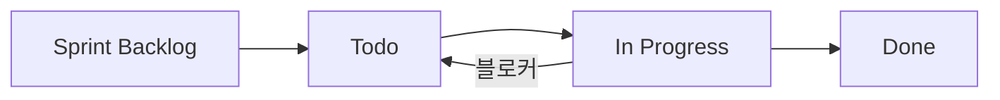

# GitHub Project 이슈 관리 / GitHub Project Issue Management

## 프로젝트 정보 / Project Info

| 항목 / Item | 값 / Value |
|---|---|
| Owner | `Ji-Min-Lee` |
| Project Number | `3` |
| Project ID | `PVT_kwHOAvGPyM4BaqqQ` |
| Repo | `Ji-Min-Lee/2026-3-sw-architect-studio-project` |
| Board URL | https://github.com/users/Ji-Min-Lee/projects/3/views/2 |

## 팀 구조 / Team Structure

| 팀 / Team | 역할 / Role | 이름 / Name | GitHub Username |
|---|---|---|---|
| Team 1 | 실험팀 | DONG HO SHIN | `gukuo` |
| Team 1 | 실험팀 | GYEONGJIN SHIN | `Gyeongjin-lge` |
| Team 1 | 실험팀 | KYUDAE BAHN | `k-bahn` |
| Team 1 | 실험팀 | TAEJOON SONG | `TJSong` |
| Team 2 | 개발팀 | HUNG SON TONG | `hungson565` |
| Team 2 | 개발팀 | JIMIN LEE | `Ji-Min-Lee` |
| Team 2 | 개발팀 | SUNGHO SHIN | `sungho1shin` |

**이슈 생성 시 assignee 규칙**
- `team1` 라벨 → assignees: `gukuo`, `Gyeongjin-lge`, `k-bahn`, `TJSong` 중 담당자
- `team2` 라벨 → assignees: `hungson565`, `Ji-Min-Lee`, `sungho1shin` 중 담당자
- `all-teams` 라벨 → 필요 시 양팀 대표 또는 전원 지정

**라벨 + Assignee 매핑 예시**

```bash
# Team 1 이슈
--label "team1" --assignee "TJSong" --assignee "k-bahn"

# Team 2 이슈
--label "team2" --assignee "Ji-Min-Lee" --assignee "sungho1shin"

# 전체 팀 이슈
--label "all-teams" --assignee "Ji-Min-Lee"
```

---

## 필드 ID / Field IDs

| 필드 / Field | ID | 타입 / Type |
|---|---|---|
| Title | `PVTF_lAHOAvGPyM4BaqqQzhVgjsE` | text |
| Assignees | `PVTF_lAHOAvGPyM4BaqqQzhVgjsI` | — |
| Status | `PVTSSF_lAHOAvGPyM4BaqqQzhVgjsM` | single_select |
| Labels | `PVTF_lAHOAvGPyM4BaqqQzhVgjsQ` | — |
| Milestone | `PVTF_lAHOAvGPyM4BaqqQzhVgjsY` | — |
| Start Date | `PVTF_lAHOAvGPyM4BaqqQzhVgyTY` | date |
| End Date | `PVTF_lAHOAvGPyM4BaqqQzhVgyTc` | date |

## Status 옵션 / Status Options

| 값 / Value | ID |
|---|---|
| Sprint Backlog | `4a57234f` |
| Todo | `32d016b7` |
| In Progress | `d57c839e` |
| Done | `1d55117a` |

---

## CRUD 명령어 / CRUD Commands

### CREATE — 이슈 생성 후 프로젝트에 추가

```bash
# 1. 이슈 생성 (템플릿 기반 본문)
ISSUE_URL=$(gh issue create \
  --repo Ji-Min-Lee/2026-3-sw-architect-studio-project \
  --title "[TYPE-N] 제목" \
  --body "$(cat <<'EOF'
**Sprint**: wX-Y (MM/DD–DD) | **Team**: Team N | **QA**: QAS-N 속성명

## Objective
목표 설명.

## Steps
- [ ] 단계 1
- [ ] 단계 2

## Pass Criteria
| 항목 | 기준 |
|------|------|
| 지표 | 목표값 |

## Output
- 결과물 → 연결 문서
EOF
)" \
  --label "M2,w3-1,teamN,QAS-N" \
  --assignee "Ji-Min-Lee" \
  --print-url)

# 2. 프로젝트에 추가
ITEM_ID=$(gh project item-add 3 --owner Ji-Min-Lee --url "$ISSUE_URL" --format json | python3 -c "import json,sys; print(json.load(sys.stdin)['id'])")

# 3. Status 설정
gh project item-edit --project-id PVT_kwHOAvGPyM4BaqqQ \
  --id "$ITEM_ID" \
  --field-id PVTSSF_lAHOAvGPyM4BaqqQzhVgjsM \
  --single-select-option-id 32d016b7   # Todo

# 4. Start Date 설정
gh project item-edit --project-id PVT_kwHOAvGPyM4BaqqQ \
  --id "$ITEM_ID" \
  --field-id PVTF_lAHOAvGPyM4BaqqQzhVgyTY \
  --date "2026-MM-DD"

# 5. End Date 설정
gh project item-edit --project-id PVT_kwHOAvGPyM4BaqqQ \
  --id "$ITEM_ID" \
  --field-id PVTF_lAHOAvGPyM4BaqqQzhVgyTc \
  --date "2026-MM-DD"
```

### READ — 이슈 목록 조회

```bash
# 전체 목록 (상태별 정렬)
gh project item-list 3 --owner Ji-Min-Lee --format json \
  | python3 -c "
import json, sys
items = json.load(sys.stdin)['items']
for i in sorted(items, key=lambda x: x.get('status','')):
    print(f\"[{i.get('status','?'):15}] {i['title']}\")
"

# 특정 상태만 필터
gh project item-list 3 --owner Ji-Min-Lee --format json \
  | python3 -c "
import json, sys
items = json.load(sys.stdin)['items']
for i in items:
    if i.get('status') == 'In Progress':
        print(i['title'], '|', i.get('start Date',''), '-', i.get('end Date',''))
"

# 특정 이슈 상세
gh issue view NUMBER --repo Ji-Min-Lee/2026-3-sw-architect-studio-project
```

### UPDATE — 이슈 수정

```bash
# Status 변경 (ITEM_ID는 project item-list로 확인)
gh project item-edit --project-id PVT_kwHOAvGPyM4BaqqQ \
  --id ITEM_ID \
  --field-id PVTSSF_lAHOAvGPyM4BaqqQzhVgjsM \
  --single-select-option-id d57c839e   # In Progress

# 날짜 변경
gh project item-edit --project-id PVT_kwHOAvGPyM4BaqqQ \
  --id ITEM_ID \
  --field-id PVTF_lAHOAvGPyM4BaqqQzhVgyTc \
  --date "2026-MM-DD"

# 이슈 본문/제목/라벨/담당자 수정
gh issue edit NUMBER \
  --repo Ji-Min-Lee/2026-3-sw-architect-studio-project \
  --title "새 제목" \
  --body "새 본문" \
  --add-label "QAS-1" \
  --add-assignee "Ji-Min-Lee"
```

### DELETE / CLOSE — 이슈 닫기

```bash
# 이슈 닫기 (Done 처리 후)
gh issue close NUMBER \
  --repo Ji-Min-Lee/2026-3-sw-architect-studio-project \
  --comment "완료: 결과 요약"

# 프로젝트에서 항목 제거 (이슈는 유지)
gh project item-delete 3 --owner Ji-Min-Lee --id ITEM_ID
```

---

## 이슈 제목 규칙 / Title Convention

```
[PREFIX-N] 짧은 설명
```

| Prefix | 용도 |
|---|---|
| `EXP-NN` | 실험 태스크 (e.g. EXP-01) |
| `P2-TN` | Phase 2 팀 태스크 |
| `P3-TN` | Phase 3 팀 태스크 |
| `ARCH` | 아키텍처 결정 태스크 |
| `DOC` | 문서 작업 |
| `BUG` | 버그 수정 |

## 라벨 규칙 / Label Convention

| 라벨 / Label | 의미 |
|---|---|
| `M1` / `M2` / `M3` | 마일스톤 |
| `w1-1`, `w2-1`, `w3-1` … | 스프린트 주차 |
| `team1` / `team2` | 담당 팀 |
| `QAS-1` … `QAS-5` | 연관 품질 속성 시나리오 |
| `experiment` | 실험 태스크 |
| `architecture` | 아키텍처 결정 |

---

## 워크플로우 / Workflow



**Status 전환 기준**

| From → To | 조건 |
|---|---|
| Sprint Backlog → Todo | 스프린트 계획에 포함 |
| Todo → In Progress | 작업 시작 |
| In Progress → Done | 완료 기준 충족 + 결과 문서 작성 |

---

## 빠른 ITEM_ID 조회 / Quick ITEM_ID Lookup

```bash
gh project item-list 3 --owner Ji-Min-Lee --format json \
  | python3 -c "
import json, sys
items = json.load(sys.stdin)['items']
for i in items:
    print(i['id'], '|', i['title'])
" | grep "검색어"
```
